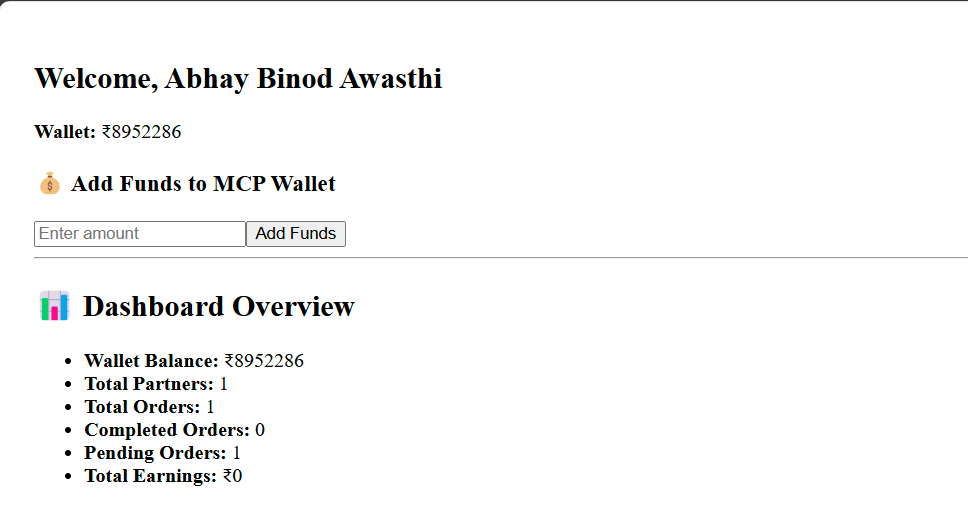
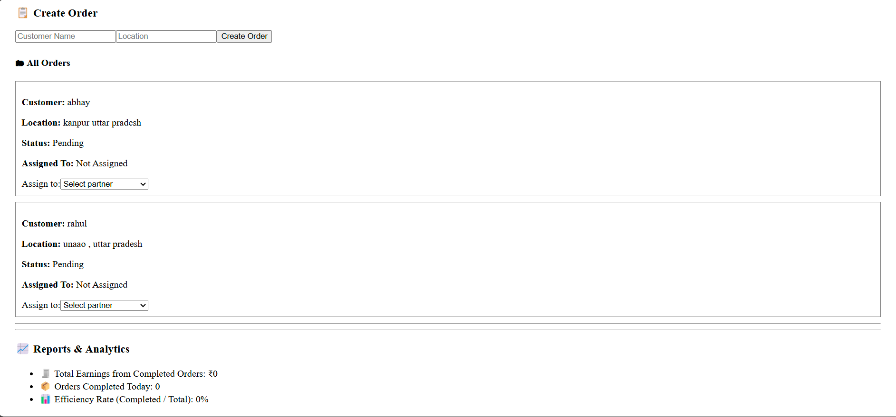
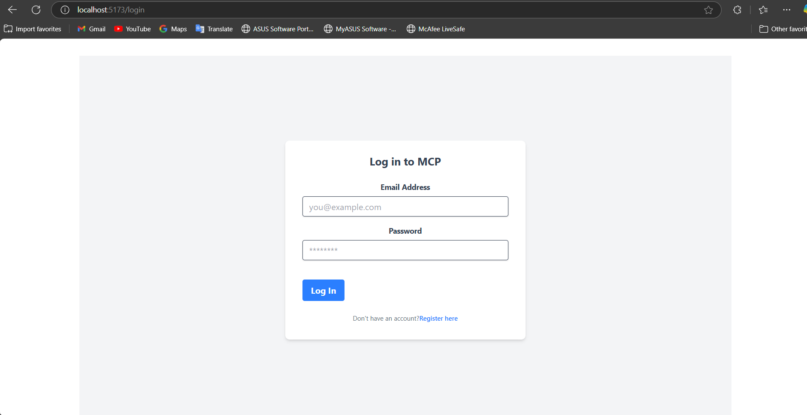
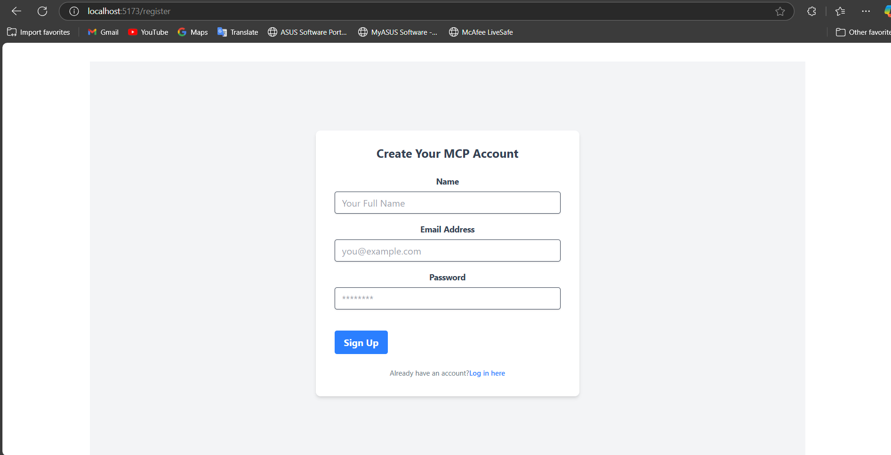

#   🛵 Micro Collection Partner (MCP) System 💰

##   📦 Overview

The **MCP System** is a comprehensive solution designed to revolutionize the management of pickup partners in micro collection services. 🚀 This dual-application platform (web and mobile) empowers Micro Collection Partners (MCPs) to efficiently orchestrate their operations, from partner administration and order logistics to seamless financial transactions. [cite: 1, 2, 3, 4, 5]

This system provides MCPs with essential tools to:

* 💰 Manage wallet balances and transaction histories. [cite: 2, 3]
* 👥 Oversee pickup partners, including onboarding, role assignment, and performance tracking. [cite: 3, 6]
* 🚚 Track order statuses in real-time and dispatch them to partners. [cite: 4, 6]
* 💸 Handle financial flows, such as funding wallets and distributing earnings. [cite: 3]

**✨ Project Status:**

While under active development, the project has achieved significant milestones, with approximately 60% of the core features implemented. Key accomplishments include:

* ✅   User Authentication (MCP & Pickup Partner)
* 💳   MCP Wallet Management (Funding, Viewing Balance)
* 📍   Basic Order Creation and Assignment
* 📊   Dashboard with Key Performance Indicators

##   🔑 Key Features

The MCP System is packed with features designed to optimize micro collection operations:

###   📱 MCP App

The MCP App serves as the central command center for Micro Collection Partners, providing them with granular control over their operations. [cite: 5]

1.  📊 Dashboard: Get a bird's-eye view of your business performance. [cite: 6]
    * 💰   View total wallet balance [cite: 2]
    * 👥   See all pickup partners and their current status (active/inactive) [cite: 2]
    * 🚚   Track total, completed, and pending orders across all partners [cite: 2]
    * 

2.  🤝 Pickup Partner Management: Onboard, organize, and manage your team of pickup partners. [cite: 6]
    * ➕   Add new Pickup Partners [cite: 3]
    * 🗑️   Delete existing partners [cite: 3]
    * Roles and responsibilities assignment [cite: 3]
    * Set commission or fixed payment per order [cite: 3]
    * Track active vs. inactive partners [cite: 3]

3.  💸 Wallet & Transactions: Seamlessly manage funds within the system. [cite: 6]
    * 💰   MCP Wallet: Load funds via UPI, bank transfer, etc., and distribute to partners [cite: 2]
    * 💳   Pickup Partner Wallet: Manage partner balances (add/subtract funds) [cite: 3]
    * 📜   Transaction History: Maintain a detailed record of all financial transactions [cite: 3]

4.  🚚 Order Management & Tracking: Efficiently handle order dispatch and monitoring. [cite: 4, 6]
    * Assign orders to pickup partners (manually or with auto-assign) [cite: 4]
    * Track live order status (Pending, In Progress, Completed) [cite: 4]
    * Identify the partner assigned to each order [cite: 4]
    * Generate daily/weekly reports [cite: 4]
    * 

5.  🔔 Notifications & Alerts: Stay informed with real-time updates. [cite: 5, 6]
    * 🚚   Order status updates [cite: 4, 5]
    * ⚠️   Low wallet balance alerts [cite: 5]
    * ✅   Partner order completion notifications [cite: 5]

6.  📈 Reports & Analytics: Gain insights into your business. [cite: 5, 6]
    * Earnings reports [cite: 6]
    * Order history [cite: 6]
    * Efficiency tracking [cite: 6]

###   📱 Pickup Partner App

The Pickup Partner App empowers pickup partners to efficiently manage their assigned tasks and track their earnings. [cite: 6, 7]

1.  📇 Dashboard: Partners get a clear view of their daily tasks and earnings. [cite: 7]
    * See available orders [cite: 7]
    * Track earnings [cite: 7]
    * View completed tasks [cite: 7]

2.  📦 Order Management: Partners can interact with assigned orders. [cite: 7]
    * Accept/reject orders [cite: 7]
    * Update order status (In Progress, Completed) [cite: 7]

3.  💰 Wallet: Partners can monitor their financial activity. [cite: 7]
    * View earnings [cite: 7]
    * Track withdrawals [cite: 7]
    * See funds received from MCP [cite: 7]

4.  📍 Live Order Tracking: Partners can provide real-time updates on order progress. [cite: 7]
    * Update status (In Progress, Completed) [cite: 7]

5.  🗺️ Location Integration: Partners can navigate to customer locations. [cite: 7]
    * Google Maps integration for navigation [cite: 4]

6.  🔔 Notifications: Partners receive timely alerts. [cite: 5, 7]
    * New order alerts [cite: 7]
    * Payment updates [cite: 7]
    * Reminders [cite: 7]

7.  ⭐ Performance Stats: Partners can track their performance. [cite: 7]
    * Completed orders [cite: 7]
    * Ratings (if added) [cite: 7]

##   ⚙️ How It Works

The MCP System facilitates a streamlined workflow between MCPs and Pickup Partners: [cite: 7, 8]

1.  🤝 Partner Onboarding: MCPs add Pickup Partners, who then complete their registration using the Pickup Partner App. [cite: 7]
2.  🚚 Order Assignment: MCPs dispatch orders to Pickup Partners, either manually or through automated assignment. [cite: 4, 7]
3.  🔔 Order Notification: Pickup Partners receive notifications about new order assignments. [cite: 7]
4.  ✅ Order Acceptance & Completion: Pickup Partners accept assigned orders and update the order status as they progress. [cite: 7]
5.  💸 Payment Processing: MCPs manage payments to Pickup Partners through the integrated wallet system, with all transactions meticulously recorded. [cite: 8]

##   🛠️ Tech Stack

The MCP System leverages a robust and modern technology stack: [cite: 4]

* 📱 Frontend:
    * React Native (for mobile applications) [cite: 4]
    * React.js (for web application) [cite: 4]
* 💻 Backend:
    * Node.js with Express / Python Flask [cite: 4]
* 🗄️ Database:
    * MongoDB [cite: 4]
* 💳 Payments:
    * Razorpay [cite: 4]
* 🗺️ Maps & Tracking:
    * Google Maps API [cite: 4, 5]

##   📸 Screenshots

* **MCP Login Page:**
    
* **MCP Registration Page:**
    

##   🚀 Installation

To get the MCP System up and running locally, follow these steps:

1.  **Clone the repository:**

    ```bash
    git clone <repository_url>
    cd <project_directory>
    ```

2.  **Install dependencies:**

    * **For React.js (MCP Web App):**

        ```bash
        cd mcp-web # or the relevant directory name
        npm install # or yarn install
        ```

    * **For React Native (Pickup Partner Mobile App):**

        ```bash
        cd pickup-partner-app # or the relevant directory name
        npm install # or yarn install (if using yarn)
        npx react-native run-android # or run-ios, if you have the setup
        ```

    * **For Node.js/Flask Backend:**

        ```bash
        cd backend # or the relevant directory name
        npm install # or pip install -r requirements.txt (for Flask)
        ```

3.  **Set up the database:**

    * Ensure you have MongoDB installed and running.
    * Create a `.env` file in the `backend` directory and add your MongoDB connection string:

        ```
        MONGODB_URI=mongodb://your_mongodb_connection_string
        ```

4.  **Configure API keys:**

    * If you are using Razorpay or Google Maps API, obtain the necessary API keys and add them to your `.env` file.

5.  **Run the applications:**

    * **Backend:**

        ```bash
        cd backend
        npm start # or python app.py (for Flask)
        ```

    * **MCP Web App:**

        ```bash
        cd mcp-web
        npm start
        ```

    * **Pickup Partner Mobile App:**

        ```bash
        cd pickup-partner-app
        npx react-native start
        # In another terminal:
        npx react-native run-android # or run-ios
        ```

##   💻 Usage

###   MCP Workflow

1.  **Login:** MCPs log in to the MCP Web App to access the dashboard.
2.  **Partner Management:**
    * Add new partners by providing their details.
    * Assign roles (e.g., Collector, Supervisor) to partners.
3.  **Order Management:**
    * Create new orders with relevant details.
    * Assign orders to available pickup partners.
    * Monitor the status of orders (Pending, In Progress, Completed).
4.  **Wallet Management:**
    * Add funds to the MCP wallet.
    * Distribute earnings to partner wallets.
    * View transaction history.

###   Pickup Partner Workflow

1.  **Login:** Pickup Partners log in to the Pickup Partner Mobile App.
2.  **Order Acceptance:**
    * View a list of available orders.
    * Accept or reject order assignments.
3.  **Order Update:**
    * Update the order status as they proceed (e.g., In Progress, Completed).
4.  **Wallet View:**
    * Check their current earnings and transaction history.

##   🤝 Contributing

Contributions to the MCP System are welcome! To contribute:

1.  Fork the repository.
2.  Create a new branch for your feature or bug fix.
3.  Make your changes and commit them.
4.  Push your changes to your fork.
5.  Submit a pull request.

Please ensure your code follows the project's coding standards and includes appropriate tests.

##   📄 License

\[Specify the project's license (e.g., MIT, Apache 2.0)]

##   📧 Contact

\[Provide contact information for questions or support (e.g., email address, support forum link)]
